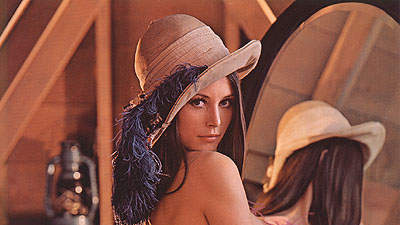
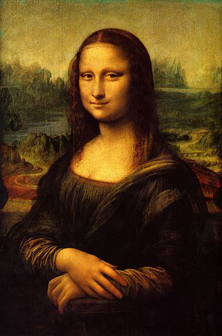
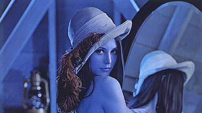
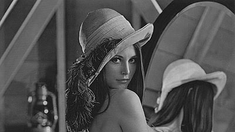
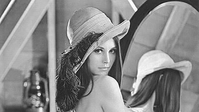
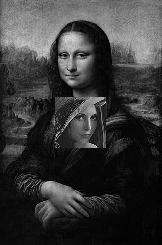
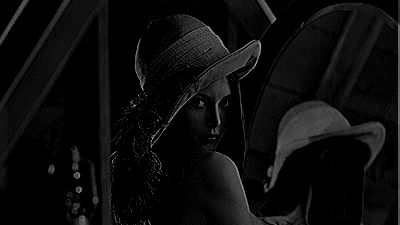
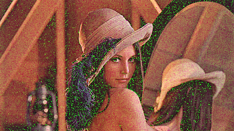

# PROBLEM SET 0. Image as function

### PROBLEM 1: 
#### Find two interesting images to use. They should be color, rectangular in shape
#### (NOT square). Pick one that is wide and one tall.
 You might find some classic vision examples here. Or take your own. Make sure
 the image width or height do not exceed 512 pixels.
 Input:  images
 Output: Store the two images as ps0-1-a-1.png and ps0-1-a-2.png inside the output folder
 
 
 

### PROBLEM 2:
#### Color  planes
- a) Swap the red and blue pixels of image 1
     Output: Store as ps0-2-a-1.png in the output folder
- b) Create a monochrome image (img1\_green) by selecting the green channel of
     image 1
     Output: ps0-2-b-1.png
- c) Create a monochrome image (img1\_red) by selecting the red channel of image 1
     Output: ps0-2-c-1.png
- d) Which looks more like what you’d expect a monochrome image to look like?
     Would you expect a computer vision algorithm to work on one better than the
     other?
     Output: Text response in report ps0\_report.pdf
 
 
 
 

### PROBLEM 3:
#### Replacement of pixels (Note: For this, use the better channel from 2-b/2-c as
#### monochrome versions.)
- a) Take the inner center square region of 100x100 pixels of monochrome version
     of image 1 and insert them into the center of monochrome version of image 2
     Output: Store the new image created as ps0-3-a-1.png
 
   
  
### PROBLEM 4
#### Arithmetic and Geometric operations
- a) What is the min and max of the pixel values of img1\_green? What is the mean?
     What is the standard deviation?  And how did you compute these?
     Output: Text response, with code snippets
- b) Subtract the mean from all pixels, then divide by standard deviation, then
     multiply by 10 (if your image is 0 to 255) or by 0.05 (if your image ranges
     from 0.0 to 1.0). Now add the mean back in.
     Output: ps0-4-b-1.png
- c) Shift img1\_green to the left by 2 pixels.
     Output: ps0-4-c-1.png
- d) Subtract the shifted version of img1\_green from the original, and save the
     difference image.
     Output: ps0-4-d-1.png (make sure that the values are legal when you write
    the image so that you can see all relative differences), text response: What
    do negative pixel values mean anyways?

  
  
  

### PROBLEM 5
- a) Take the original colored image (image 1) and start adding Gaussian noise to
     the pixels in the green channel. Increase sigma until the noise is somewhat
     visible.
     Output: ps0-5-a-1.png, text response: What is the value of sigma you had to
     use?
- b) Now, instead add that amount of noise to the blue channel.
     Output: ps0-5-b-1.png
 -c) Which looks better? Why?
     Output: Text response
 
 
 

 The human eye is much less sensitive to the blue color.
 [More information](http://hyperphysics.phy-astr.gsu.edu/hbase/vision/rodcone.html#c3)

