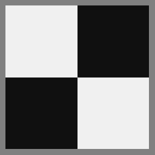
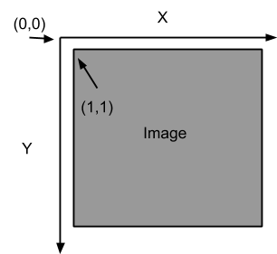

# PROBLEM SET 1. Edges and Lines
 **RULES** : You may use Matlab (or image processing functions on other platforms)
 to find edges, such as Canny or other operators. Don’t forget that those have a
 variety of parameters and you may need to experiment with them. BUT: YOU MAY NOT USE 
 ANY HOUGH TOOLS. For example, you need to write your own accumulator array data
 structures and code for voting and peak finding.

### PROBLEM 1: 
#### Object boundaries
 For this question we will use input/ps1-input0.png:
 
 
 
 This is a test image for which the answer should be clear, where the “object”
 boundaries are only lines.

- a) Load the input grayscale image (input/ps1-input0.png) as img and generate an 
     edge image – which is a binary image with white pixels (1) on the edges and
     black pixels (0) elsewhere.

     For reference, do “doc edge” in Matlab and read about edge operators. Use one
     operator of your choosing – for this image it probably won’t matter much. If
     your edge operator uses parameters (like ‘canny’) play with those until you
     get the edges you would expect to see.

    **Output**: Store edge image (img\_edges) as ps1-1-a-1.png

### PROBLEM 2:
#### Hough Transform
 Implement a Hough Transform method for finding lines. Note that the coordinate
 system used is as pictured below with the origin placed one pixel above and to
 the left of the upper-left pixel of the image and with the Y-axis pointing downwards.
 
 
 
 Thus, the pixel at img(r,c) corresponds to the (x,y) coordinates (r,c), i.e. x=c and
 y=r. This pixel should vote for line parameters (ρ,θ) where: ρ = x⋅cos(θ) + y⋅sin(θ),
 and θ = atan2(y,x).
 
 
 
 This has the effect of making the positive angular direction clockwise instead of 
 counter-clockwise in the usual convention. Theta (θ) = zero still points in the
 direction of the positive X-axis.

- a) Write a function hough\_lines\_acc that computes the Hough Transform for lines
     and produces an accumulator array. Your code should conform to the specifications
     of the Matlab function hough: http://www.mathworks.com/help/images/ref/hough.html
     Note that it has two optional parameters RhoResolution and Theta, and returns
     three values - the hough accumulator array H, theta (θ) values that correspond to
     columns of H and rho (ρ) values that correspond to rows of H.

     Apply it to the edge image (img_edges) from question 1:
        [H, theta, rho] = hough_lines_acc(img_edges);
     Or, with one optional parameter specified (θ = integers -90 to 89, i.e. 180
     values including 0):
        [H, theta, rho] = hough_lines_acc(img_edges, 'Theta', -90:89);

     **Function** file: hough_lines_acc.m containing function hough_lines_acc (identical name)

     **Output**: Store the hough accumulator array (H) as ps1-2-a-1.png (note: write a
     normalized uint8 version of the array so that the minimum value is mapped to
     0 and maximum to 255). 

- b) Write a function hough\_peaks that finds indices of the accumulator array (here
     line parameters) that correspond to local maxima. Your code should conform to the
     specifications of the http://www.mathworks.com/help/images/ref/houghpeaks.html
     Note that you need to return a Qx2 matrix with row indices (here rho) in
     column 1, and column indices (here theta) in column 2. (This could be used for
     other peak finding purposes as well.)

     Call your function with the accumulator from the step above to find up to 10
     strongest lines:
        peaks = hough_peaks(H, 10);

    **Function file**: hough_peaks.m

    **Output**: ps1-2-b-1.png - like above, with peaks highlighted (you can use
     drawing functions).

- c) Write a function hough\_lines\_draw to draw color lines that correspond to peaks
     found in the accumulator array. This means you need to look up rho, theta values
     using the peak indices, and then convert them (back) to line parameters in cartesian
     coordinates (you can then use regular line-drawing functions).

     Use this to draw lines on the original grayscale (not edge) image. The lines should
     extend to the edges of the image (aka infinite lines):
        hough_lines_draw(img, 'ps1-2-c-1.png', peaks, rho, theta);

    **Function file**: hough_lines_draw.m
    
    **Output**: ps1-2-c-1.png - can be saved as a plot directly from hough\_lines\_draw().
    It should look something like this:
    
    
    You might get lines at the boundary of the image too depending upon the edge operator
    you selected (but those really shouldn’t be there).

-d) What parameters did you use for finding lines in this image?
    
    **Output**: Text response describing your accumulator bin sizes, threshold and neighborhood
    size parameters for finding peaks, and why/how you picked those.

### PROBLEM 3:
#### Now we’re going to add some noise.
- a) Use ps1-input0-noise.png - same image as before, but with noise. Compute a modestly
     smoothed version of this image by using a Gaussian filter. Make σ at least a few pixels big.
     
     **Output**: Smoothed image: ps1-3-a-1.png

- b) Using an edge operator of your choosing, create a binary edge image for both the
     original image (ps1-input0-noise.png) and the smoothed version above.

    **Output**: Two edge images: ps1-3-b-1.png (from original), ps1-3-b-2.png (from smoothed)

- c) Now apply your Hough method to the smoothed version of the edge image. Your goal is to
     adjust the filtering, edge finding, and Hough algorithms to find the lines as best you can
     in this test case.

    **Output**:
        - Hough accumulator array image with peaks highlighted: ps1-3-c-1.png 
        - Intensity image (original one with the noise) with lines drawn on them: ps1-3-c-2.png
        - Text response: Describe what you had to do to get the best result you could.

### PROBLEM 4
#### For this question use: ps1-input1.png
- a) This image has objects in it whose boundaries are circles (coins) or lines (pens). For
     this question  you’re still finding lines. Load/create a monochrome version of the image
     (you can pick a single color channel or use a built-in color to grayscale conversion
     function), and compute a modestly smoothed version of this image by using a Gaussian
     filter. Make σ at least a few pixels big.
    
     **Output**: Smoothed monochrome image: ps1-4-a-1.png

- b) Create an edge image for the smoothed version above.
    
     **Output**: Edge image: ps1-4-b-1.png

- c) Apply your Hough algorithm to the edge image to find lines along the pens. Draw the 
     lines in color on the  original monochrome (not edge) image. The lines can extend to
     the edges of the image.
    
     **Output**:
        - Hough accumulator array image with peaks highlighted: ps1-4-c-1.png
        - Original monochrome image with lines drawn on it: ps1-4-c-2.png
        - Text response: Describe what you had to do to get the best result you could.

### PROBLEM 5
Now write a circle finding version of the Hough transform. You can implement either the
single point method or the point plus gradient method. **WARNING: This part may be hard!!!
Leave extra time!**
If you find your arrays getting too big (hint, hint) you might try make the range of radii
very small to start with and see if you can find one size circle. Then maybe try the different sizes.

- a) Implement hough\_circles|_acc to compute the accumulator array for a given radius.
     Using the same original image (monochrome) as above (ps1-input1.png), smooth it, find
     the edges (or directly use edge image from 4-b above), and try calling your function with
     radius = 20:
        H = hough_circles\_acc(img\_edges, 20);

     This should return an accumulator H of the same size as the supplied image. Each pixel
     value of the accumulator array should be proportional to the likelihood of a circle of
     the given radius being present (centered) at that location. Find circle centers by using
     the same peak finding function:
        centers = hough_peaks(H, 10);

     **Function file**: hough_circles_acc.m (hough_peaks.m should already be there)
    
     **Output**:
        - Smoothed image: ps1-5-a-1.png (this may be identical to  ps1-4-a-1.png)
        - Edge image: ps1-5-a-2.png (this may be identical to  ps1-4-b-1.png)
        - Original monochrome image with the circles drawn in color:  ps1-5-a-3.png

- b) Implement a function  find\_circles that combines the above two steps, searching for circles
     within a given radius range, and returns circle centers along with their radii:
        [centers, radii] = find_circles(img_edges, [20 50]);

    **Function file**: find\_circles.m
    
    **Output**:
        - Original monochrome image with the circles drawn in color:  ps1-5-b-1.png
        - Text response: Describe what you had to do to find circles.

### PROBLEM 6
#### More realistic images. 
Now that you have Hough methods working, we’re going to try them on images that have clutter
in them - visual elements that are not part of the objects to be detected. The image to use
is ps1-input2.png.
- a) Apply your line finder. Use a smoothing filter and edge detector that seems to work best
     in terms of finding all the pen edges. Don’t worry (until b) about whether you are finding
     other lines.
    
     **Output**: Smoothed image you used with the Hough lines drawn on them: ps1-6-a-1.png

- b) Likely the last step found lines that are not the boundaries of the pens. What are the
     problems present?
    
     **Output**: Text response

- c) Attempt to find only the lines that are the *boundaries* of the pen.  Three operations
     you need to try are better thresholding in finding the lines (look for stronger edges),
     checking the minimum length of the line, looking for nearby parallel lines.
    
     **Output**: Smoothed image with new Hough lines drawn: ps1-6-c-1.png

### PROBLEM 7
#### Finding circles on the same clutter image (ps1-input2.png).  
- a) Apply your circle finder. Use a smoothing filter that seems to work best in terms of
    finding all the coins.
    
    **Output**:  the smoothed image you used with the circles drawn on them: ps1-7-a-1.png

- b) Are there any false alarms? How would/did you get rid of them?
    
     **Output**: Text response (if you did these steps, mention where they are in the code
     by file, line no. and also include brief snippets)

### PROBLEM 8
#### Sensitivity to distortion. 
There is a distorted version of the scene at ps1-input3.png.

- a) Apply the line and circle finders to the distorted image. Can you find lines? Circles?  
     
     **Output**: Monochrome image with lines and circles (if any) found: ps1-8-a-1.png

- b) What might you do to fix the circle problem? 
     
     **Output**: Text response describing what you might try

- c) EXTRA CREDIT:  Try to fix the circle problem (THIS IS HARD).
     
     **Output**:
        - Image that is the best shot at fixing the circle problem, with circles found: ps1-8-c-1.png
        - Text response describing what tried and what worked best (with snippets).
